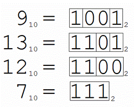

## A. Помогите Даше решить проблему

- Лимит времени: **1000 мс**  
- Лимит памяти: **128 мб**

Юная художница Даша писала поле из молодых томатов "Черри" и напевала себе под нос:

> "В мире том, где есть дом, до родного далеко,  
> А там и близко никакого к другому..."

Как в какой-то момент её совсем склонило в сон. Очнувшись в подземелье у драконов, она ужаснулась происходящему вокруг неё. Рядом с ней горел костёр, в котором сжигали за неправильный ответ. Даша нервно стояла в очереди, как вдруг незнакомка позади неё тихо сказала:

> "Так беспомощно грудь холодела, Но шаги мои были легки..."

Как бы она ни была в авангарде искусства, как бы она ни шагала навстречу судьбе, а супрематизм всё же черней...

Старик закидывал невод в море, а драконы в костёр одного за другим. И подходила всё ближе Даша, да тепло уже ощущалось...

Как вдруг привиделось ей небо, то самое высокое бесконечное небо... И послышался голос с неба, и сказал он Даше:

> "Сложи ты два числа, да будет жизнь тебе дарована.  
> И увидишь вновь меня, и услышишь черри запах."

И вот настал час роковой, поднялась Даша к палачу, встала на мостик. Задали ей вопрос: **"Что решит проблему?"**. И не решилась Даша отказать небу, и сказала она:

> "Сложение двух чисел есть мой ответ."

И вернулась Даша обратно на поле черри, и солнце вновь осветило её нежные веснушки...

### Входные данные

В единственной строке записано два целых числа A и B, таких что  
`−10¹¹ ⩽ A, B ⩽ 10¹¹`.

### Выходные данные

В единственной строке выведите сумму чисел `A` + `B`.

### Примеры

---
**STDIN**
```c++
1 2
```

**STDOUT**
```c++
3
```

### [Решение](A.cpp)

---

## B. Сдвинь меня, если сможешь

- Лимит времени: **1000 мс**
- Лимит памяти: **128 мб**

Вам необходимо реализовать **циклический сдвиг массива на `K` элементов** без затрат на дополнительную память.

Если `K > 0`, то сдвиг происходит **вправо** (т.е. последний элемент приходит в начало, а предпоследний становится последним).  
Если `K < 0`, то сдвиг происходит **влево** (т.е. первый элемент уходит в конец, а второй становится первым).

Сдвигом считается _именно изменение порядка элементов внутри массива_. Просто вывести элементы в нужном порядке **нельзя** — такой ответ приниматься не будет.

### Входные данные

В первой строке даны два целых числа —  
`N` (`1 ≤ N ≤ 10³`) — количество элементов массива,  
`K` (`−10⁹ ≤ K ≤ 10⁹`) — величина сдвига.

Во второй строке — `N` целых чисел, не превосходящих по модулю `10⁹`, разделённых пробелом.

### Выходные данные

Вывести последовательность чисел на `K` элементов

### Примеры

---
**STDIN**
```c++
5 3
1 6 2 4 22
```

**STDOUT**
```c++
2 4 22 1 6 
```
---  
**STDIN**
```c++
5 -2
1 6 2 4 22
```

**STDOUT**
```c++
2 4 22 1 6 
```

---

### Примечание

#### Пояснение к первому примеру:

сдвиг на 1 вправо - 22 1 6 2 4

сдвиг на 2 вправо - 4 22 1 6 2

сдвиг на 3 вправо - 2 4 22 1 6

#### Пояснение ко второму примеру:

сдвиг на 1 влево - 6 2 4 22 1

сдвиг на 2 влево - 2 4 22 1 6

### [Решение](B.cpp)

---

## C. Покупка друзей

- Лимит времени: **1000 мс**
- Лимит памяти: **128 мб**

Пока Гарри ехал на поезде в Хогвартс, он долго думал о том, как же ему завоевать расположение других учеников. Вдруг в проходе появилась тележка со сладостями, и Гарри пришла в голову гениальная идея - нужно угостить как можно больше ребят в поезде, чтобы поднять свой социальный рейтинг.

Гарри понравились сладости двух видов - икотные конфеты и обморочные орешки. Оказалось, что в тележке было всего  
`A` конфет и `B` орешков, Гарри решил купить их все, потому что у него было много денег.

Чтобы ребята не обиделись, Гарри хочет раздать всем одинаковое количество конфет и одинаковое количество орешков (другими словами, каждому студенту достанется ровно  
`x` орешков и `y` конфет, при этом ничейных конфет или орешков остаться не должно).

### Входные данные

Два натуральных числа `A`и `B` (`1 ≤ A, B ≤ 10⁹`), разделенных пробелом.

### Выходные данные

Натуральное число — сколько максимум ребят сможет угостить Гарри.

### Примеры

---
**STDIN**
```c++
15 45
```

**STDOUT**
```c++
15
```
---  
**STDIN**
```c++
3 1
```

**STDOUT**
```c++
1 
```

---  
**STDIN**
```c++
9 6
```

**STDOUT**
```c++
3 
```

---

### Примечание

Встроенными функциями пользоваться нельзя.


### [Решение](C.cpp)

---

## D. Игра Престолов

- Лимит времени: **1000 мс**
- Лимит памяти: **128 мб**

Сегодня вы решили отдохнуть от написания лабораторных работ и наконец посмотреть Игру Престолов. К сожалению, ваша платформа перепутала все серии местами. Перед просмотром вы захотели отсортировать эпизоды, но обнаружили, что в некоторых сезонах не хватает серий. Вам необходимо составить список всех недостающих серий.

Всего в сериале `n` сезонов. Каждый из них состоит из `m` серий, пронумерованных от `1` до `m`.

### Входные данные

В первой строке вводится число `n` — количество сезонов (`1 ≤ n ≤ 10⁶`),  
`m` — количество серий в каждом сезоне (`1 ≤ m ≤ 10⁶`)  
и `q` — количество серий, имеющихся на платформе (`1 ≤ q ≤ 10⁶`).  
Гарантируется, что произведение `n × m ≤ 10⁶`.

Далее идут `q` строк, в `i`-ой строке два числа `eᵢ` — номер эпизода, `sᵢ` — номер сезона.

### Выходные данные

В первой строке выведите число `k` — количество недостающих серий.  
Далее `k` строк с описанием серий — номер эпизода и номер сезона.  
Серии должны быть упорядочены в порядке просмотра сериала.

### Примеры

---

**STDIN**
```c++
5 1 2
1 2
1 2
```

**STDOUT**
```c++
4
1 1
1 3
1 4
1 5
```

### [Решение](D.cpp)

---

## E. Зазеркалье

- Лимит времени: **1000 мс**
- Лимит памяти: **128 мб**

Алиса решила навестить свою бабушку, которая живет в Зазеркалье.

Там все слова читаются задом наперед, и, чтобы не путать гостей сказочной страны, Алиса решила придумать новые названия, которые читаются и пишутся одинаково в обе стороны.

Она заметила, что в некоторых названиях она допустила ошибки, поэтому просит вас помочь - исправить новые названия, убрав только одну букву.

### Входные данные

В первой строке дано число `N` (`1 ≤ N ≤ 10⁶`) — количество символов в слове.  
Во второй строке идет `N` символов.

### Выходные данные

Выведите `YES`, если новое название можно исправить, иначе выведите `NO`.
### Примеры

---

**STDIN**
```c++
5
HELLO
```

**STDOUT**
```c++
NO
```

---

**STDIN**
```c++
4
PLIP
```

**STDOUT**
```c++
YES
```

---

### Примечание

Только заглавные и строчные символы английского алфавита.


### [Решение](E.cpp)

---

## F. Студенты всегда хотят спать

- Лимит времени: **1000 мс**
- Лимит памяти: **128 мб**

Студенты всегда хотят спать, поэтому на факультете придумали особую систему подсчёта оптимального дня для сна.

Каждому тяжелому дню сопоставим отрицательное число, каждому простому — положительное. Оптимальный день для сна — тот день, сумма чисел до которого и после которого совпадают.

### Входные данные

В первой строке задается единственное число `N` (`1 ≤ N ≤ 8∗10⁶`) — количество дней.

Во второй строке задается `N` целых чисел `xᵢ` (`−10⁷ ≤ xᵢ ≤ 10⁶`) — сопоставленные числа.

### Выходные данные

В единственной строке выведите **индекс** оптимального дня для сна или `-1`, если такового не существует.  
Индексация начинается с 0.

Если таких несколько, выведите самый первый индекс.

---

**STDIN**
```c++
4
1 0 -1 2
```

**STDOUT**
```c++
1
```

### [Решение](F.cpp)

---

## G. Компромисс

- Лимит времени: **1000 мс**
- Лимит памяти: **128 мб**

В недалеком будущем школьники сдают ЕГЭ по небольшому количеству предметов. `Общий балл` лежит в промежутке 
`от 15 до 30`.

В университете MST решили провести голосование за минимальный проходной балл по `t` направлениям. Каждый по очереди высказывает свое мнение. После каждого человека определите, можно ли выставить минимальный балл, который всех удовлетворит.

### Входные данные

Первая строка содержит целое число `t` (`1 ≤ t ≤ 10³`) — количество направлений.  
Далее следует описание голосования по каждому направлению.

Первая строка каждого голосования содержит целое число `n` — количество человек (`1 ≤ n ≤ 10³`).

`i`-я из следующих `n` строк каждого голосования содержит мнение к минимальному баллу от `i`-го эксперта:

- либо `≥ aᵢ`,
- либо `≤ aᵢ`  
  (`15 ≤ aᵢ ≤ 30`, `aᵢ` — целое число).

Требование `≤ aᵢ` означает, что `i`-й эксперт желает балл не выше `aᵢ`;  
Требование `≥ aᵢ` означает, что `i`-й эксперт желает балл не ниже `aᵢ`.

### Выходные данные

Для каждого направления выведите `n` строк,  
`i`-я из которых содержит балл, удовлетворяющий всех экспертов с номерами от 1 до `i` включительно.  
Если такого балла не существует, выведите `−1`.

---

**STDIN**
```c++
4
1
>= 30
6
>= 18
<= 23
>= 20
<= 27
<= 21
>= 28
3
<= 25
>= 20
>= 25
3
<= 15
>= 30
<= 24
```

**STDOUT**
```c++
30
18
18
20
20
20
-1
15
20
25
15
-1
-1
```

### [Решение](G.cpp)

---

## H. Достойное решение проблемы [доп. балл]

Немногие знают, что раньше студенты общежития на Вязьме жили в большом круглом доме. Этот дом был разделен на `N` комнат, нумерация которых идёт по часовой стрелке. Из-за наплыва тараканов в общежитии, комендант провёл исследование и ввёл тараканий коэффициент `xᵢ`, характеризующий тараканов в `i`-ой комнате. Насекомые из комнат могут размножаться, если `A & B ≠ 0`, где `A`, `B` — тараканьи коэффициенты двух комнат, а `&` — побитовая операция И.

Чтобы не нарушать санитарно-эпидемиологическое благополучие помещений, руководство общежития решило строить перегородки от тараканов между соседними комнатами, разделяя таким образом общежитие на блоки. Также руководство хотело, чтобы в общежитии был хотя бы 1 блок, для чего требуется поставить перегородку в любое место.

Задача руководства заключается в том, чтобы поставить минимальное число перегородок таким образом, чтобы тараканы из двух любых комнат в блоке не размножались.

### Входные данные

Первая строчка — число `N` (`1 ≤ N ≤ 4 * 10⁵`) — количество комнат в общежитии  
Вторая строчка — `N` тараканьих коэффициентов `xᵢ` (`1 ≤ xᵢ ≤ 10⁹`)

### Выходные данные

В единственной строке выведите `M` — минимально возможное количество блоков.

### Примеры

---

**STDIN**
```c++
7
1 1 2 12 8 6 16
```

**STDOUT**
```c++
2
```

---

**STDIN**
```c++
5
1 2 1 2 1
```

**STDOUT**
```c++
3
```

---

**STDIN**
```c++
6
1 2 3 4 5 6
```

**STDOUT**
```c++
4
```

---


### Примечание

**Пояснение к первому примеру:**

Поставив перегородки между комнатами 1 и 2, 4 и 5, получим требуемое разбиение.

**Пояснение ко второму примеру:**

Первый блок состоит из первых двух комнат, второй — из 3 и 4, третий — из единственной комнаты 5.

**Пояснение к третьему примеру:**

Перегородки можно расставить следующим образом: 1 | 2 | 3 4 | 5 | 6

---

## I. Гений трейдинга

Сэм — известный криптовалютный трейдер. Свой успех он заработал благодаря особому способу трейдинга. Каждый день Сэм определяет: пойдёт сегодня стейблкоин вверх, вниз или по кругу.

Для этого он придумал сложный алгоритм: парень переводит номер дня в двоичную систему счисления (без лидирующих нулей) и объединяет в группы одинаковые идущие подряд двоичные цифры этого числа. Если количество таких групп равняется 3, то акции пойдут вверх, иначе — вниз.



Помогите найти Сэму количество дней, в которые он может трейдить, если новые торги идут с дня `X` до дня `Y`.

### Входные данные

В единственной строке заданы два числа `X` и `Y` разделённые пробелом (`1 ≤ X ≤ Y ≤ 10¹⁸`)

### Выходные данные

В единственной строке необходимо вывести количество дней, когда акции пойдут вверх.


### Примеры

---

**STDIN**
```c++
259 263
```

**STDOUT**
```c++
2
```

---