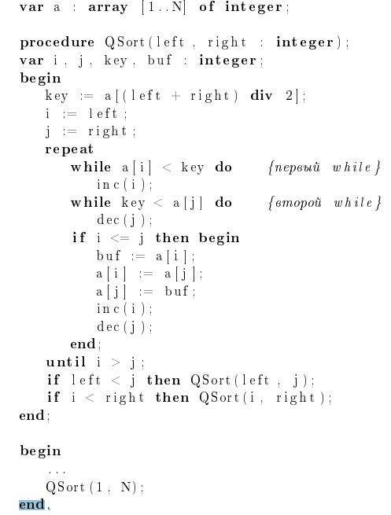

## A. Дедовы тапки

- Лимит времени: **1000 мс**
- Лимит памяти: **128 мб**

За долгие годы жизни, у вашего деда накопилось бесчисленное множество обуви разного размера, которую он постоянно раскидывает в коридоре.

Вашей бабушке надоело с ним ругаться, но, к сожалению, она не может позволить себе профессионального сортировщика тапок, поэтому она попросила вас отсортировать тапки по возрастанию размера.

Вы вспомнили, что вы учитесь в ИТМО и совсем недавно прошли сортировку вставками. Напишите программу для решения этой задачи, используя  
_**Insertion sort**_.

### Входные данные

В первой строчке дано число `1 ≤ N ≤ 10⁴` — количество тапок.

Во второй строчке дано `N` чисел в границах `1 ≤ x ≤ 10⁶` — размеры тапок.

### Выходные данные

Размеры тапок в отсортированном виде по возрастанию, разделенные между собой пробелом.

### Примеры

---

**STDIN**
```c++
6
38 37 69 39 35 39 
```

**STDOUT**
```c++
35 37 38 39 39 69
```

---

### Примечание

Использование других алгоритмов сортировки, а также встроенных сортировок запрещено и будет забанено.

### [Решение](A.cpp)

---

## B. Паттинсон

- Лимит времени: **1000 мс**
- Лимит памяти: **128 мб**

Вы — организатор ежегодного фестиваля, посвященного международному Дню патиссонов. Самым волнительным конкурсом является соревнование “Величайшие патиссоны Торжка 2023”. Проснувшись, вы внезапно осознали, что опаздываете на празднование.

Примчавшись на фестиваль, вы обнаружили, что приехало очень много людей, поэтому вам необходимо очень быстро отсортировать патиссоны по их весу, чтобы в зависимости от места участника вручить ему соответствующий приз.

Некоторые патисcоны весили отрицательное число килограмм, но из-за недосыпа вы не смутились)

### Входные данные

В первой строке дано число `1 ≤ N ≤ 10⁶` — количество участников.

Во второй строке дано `N` чисел — веса патиссонов `xᵢ`, где `−10⁹ ≤ xᵢ ≤ 10⁹`.

### Выходные данные

Веса патиссонов в отсортированном виде по возрастанию, разделенные между собой пробелом.

### Примеры

---

**STDIN**
```c++
6
38 37 69 39 3 39    
```

**STDOUT**
```c++
3 37 38 39 39 69
```

---

### Примечание

Необходимо самостоятельно реализовать быструю сортировку. Использование других алгоритмов сортировки, а также встроенных сортировок запрещено и будет забанено.

### [Решение](B.cpp)

---

## C. Любовь жестока

- Лимит времени: **1000 мс**
- Лимит памяти: **128 мб**

В жизни восьмиклассника Паши горе — любовь всей его жизни ушла к другому.

Чтобы как-то избавиться от навязчивых мыслей, он вышел погулять в парк. К сожалению, свежий воздух, сладкая газировка и Кузя Лакомкин не смогли отвлечь его от душевных терзаний.

Погруженный в собственные думы Паша споткнулся о валяющуюся на земле ветку и чуть не упал в озеро, как вдруг его осенило: "Неужели Пифагор, Евклид или Фибоначчи страдали из-за любви?" Паша сразу же вспомнил тему последнего урока по геометрии — прямоугольники и их площади.

Он стал составлять прямоугольники из веток, причем каждая веточка участвует в построении не более одного прямоугольника, при этом могут остаться и неиспользованные ветки. Сгибать веточки нельзя.

Паше стало интересно, какую максимальную суммарную площадь он может получить. Чтобы усложнить себе задачу, он решил добавить возможность укорачивать ветки, но не более чем на 1. Например, ветку с длиной 5 можно либо не уменьшать, либо получить из нее палочку длины 4.

Помогите Паше узнать максимальную суммарную площадь.

### Входные данные

В первой строке записано целое положительное число `N ≤ 10⁶` — количество веток.

Во второй строке через пробел записаны `N` натуральных чисел, не превосходящих `10⁵` — длины веточек.

### Выходные данные

В единственной строке выведите одно число `S` — максимальную суммарную площадь.

### Примеры

---

**STDIN**
```c++
4
2 4 4 2
```

**STDOUT**
```c++
8
```

---

**STDIN**
```c++
4
2 2 3 5
```

**STDOUT**
```c++
0
```

---

### Примечание

Использование встроенных сортировок или контейнеров запрещено и будет забанено.

### [Решение](C.cpp)

---

## D. Анти-QuickSort

- Лимит времени: **1000 мс**
- Лимит памяти: **128 мб**

Для сортировки последовательности чисел широко используется быстрая сортировка — **QuickSort**.

Хотя QuickSort является самой быстрой сортировкой в среднем, существуют тесты, на которых она работает очень долго.

Требуется написать программу, генерирующую тест, на котором быстрая сортировка сделает наибольшее число таких сравнений.

### Входные данные

В первой строке находится единственное число `n` (`1 ≤ n ≤ 70000`).

### Выходные данные

Вывести перестановку чисел от `1` до `n`, на которой быстрая сортировка выполнит максимальное число сравнений. Если таких перестановок несколько, вывести любую из них.

### Примеры

---

**STDIN**
```c++
3
```

**STDOUT**
```c++
1 3 2
```

---

### Примечание


Будем считать, что quicksort, для которого мы генерируем контртест, задаётся следующим псевдокодом:



### [Решение](D.cpp)

---

## E. Рейтинг

- Лимит времени: **2000 мс**
- Лимит памяти: **128 мб**

В университете ИТМО есть таблица, в которой указан рейтинг студента. Этот рейтинг показывает уровень познаний учащихся в Алгоритмах и структурах данных. Чем выше число, тем меньше студенту времени нужно для решения сложных задач.

Однажды преподаватели решили узнать, как хорошо обучающиеся разбираются в данном предмете. Для этого они попросили вас, опытного программиста с высоким рейтингом, помочь им.

Вы взяли список всех студентов. Но так как список составлен в алфавитном порядке, то числа, показывающие уровень знаний, находятся в не отсортированном порядке.

Вам нужно узнать, насколько данный массив не отсортирован по возрастанию. Найдите все пары, которые нарушают возрастание.

### Входные данные

Первая строка содержит число `N` (`1 ≤ N ≤ 10⁶`) — количество студентов в списке.

Вторая строка содержит `N` чисел, которые показывают рейтинг студента, числа не превосходят по модулю `10⁹`.

### Выходные данные

Выведите число найденных пар.

### Примеры

---

**STDIN**
```c++
5
5 3 2 4 1
```

**STDOUT**
```c++
8
```

---

### Примечание

Необходимо самостоятельно реализовать сортировку слиянием. Использование других алгоритмов сортировки, а также встроенных сортировок запрещено и будет забанено.

### [Решение](E.cpp)

---

## F. Нейроночка

- Лимит времени: **1000 мс**
- Лимит памяти: **128 мб**

На заре появления сайта “ПоискКино” молодому и перспективному стажеру поручили написать страничку “Топ-`k` лучших фильмов”.

Поскольку сайт только появился, то его популярность была не велика, поэтому рейтинг каждого фильма оценивали `n` критиков. Финальный рейтинг фильма высчитывался по линейной формуле  
`a₁ * x₁ + a₂ * x₂ … + aₙ * xₙ`.

В данной формуле используются следующие обозначения:

`xᵢ` — оценка, которую `i`-й критик поставил данному фильму  
`aᵢ` — коэффициент авторитетности `i`-го критика

Напишите программу, выводящую `k` фильмов с самыми высокими показателями рейтинга. Чтобы избежать переполнения, рейтинг фильма считайте по модулю `10⁹ + 7`.

### Входные данные

Первая строка — числа `n, m, k`, разделенные пробелом — количество критиков, фильмов всего и фильмов в рейтинге.

Вторая строка — `n` целых чисел `a₁, a₂, …, aₙ`, разделенных пробелом — коэффициенты авторитетности критиков

Каждая из следующих `m` строк имеет следующий вид — `j`-я (`1 ≤ j ≤ m`) строка описывает `j`-й фильм:

`n` целых чисел `x₁, x₂, …, xₙ`, разделенных пробелом — оценки критиков для `j`-го фильма

### Выходные данные

Выведите `k` чисел — номера `k` лучших фильмов от фильма с самым высоким рейтингом до фильма с самым низким рейтингом. Если два фильма имеют одинаковый рейтинг, сначала выведите фильм с меньшим номером.

### Примеры

---

**STDIN**
```c++
6 4 2
5 1 2 0 2 4
1 0 9 2 9 5
5 5 2 0 5 2
2 7 2 2 5 2
5 2 4 2 2 5
```

**STDOUT**
```c++
1 4
```

---

### Примечание

Использование встроенных сортировок или контейнеров запрещено и будет забанено.

### [Решение](F.cpp)

---

## G. Непрерывное техническое образование

- Лимит времени: **1000 мс**
- Лимит памяти: **128 мб**

> "Вот выпадет снег - я ботать начну", 

— так думал первокурсник Саша в начале семестра.

Он еще не знал, что в городе, в котором расположен его университет, снег не выпадает. Осознание настигло его на сессии, когда жесткий рабочий стол в коворкинге заменил теплую постель, а энергетик - любую жидкость в его бокале. Тогда Саша дал себе обещание, что если его не отчислят, он будет все делать вовремя.

К счастью для Саши, преподаватели сжалились над ним и допустили до дальнейшей учебы. Тогда он решил составить расписание выполнения лабораторных работ в следующем семестре.

Саша посмотрел рабочий план и увидел список всех работ в таком формате: в первой строке число `N` — количество всех лабораторных работ, далее в `N` строках через пробел записаны по 2 числа `T` и `D` — количество дней, необходимое на выполнение работы, и крайний день сдачи.

Заметим, что в университете, в котором учится Саша, действует необычная система оценивания: за каждую работу начисляется целое число баллов (может быть отрицательным) равное разности крайнего срока исполнения работы и момента ее фактического завершения.

Саша начинает выполнять работы в самом начале семестра (**в день номер 0**). Все лабораторные работы должны быть выполнены. Помогите Саше составить расписание с наибольшей суммой баллов за все лабы и выведите эту сумму.

### Входные данные

В первой строке число `N < 10⁶`.

Далее в `N` строках через пробел записаны по 2 числа `T` и `D < 10⁹`.

### Выходные данные

В единственной строке выведите одно число `S` — максимальную сумму баллов за все лабораторные работы.

### Примеры

---

**STDIN**
```c++
4
4 2
3 10
2 8
4 15
```

**STDOUT**
```c++
6
```

---

### Примечание

Использование встроенных сортировок или контейнеров запрещено и будет забанено.

### [Решение](G.cpp)

---

## H. Грязные игры [доп. балл]

- Лимит времени: **1000 мс**
- Лимит памяти: **256 мб**

В некотором славном уездном городке `N` испокон веков проводятся скачки на лошадях, которые посещают все жители города.

Конечно же на скачках действует тотализатор, поэтому любой желающий может поставить на понравившуюся ему лошадь. К сожалению, в городе `N` все решают деньги, поэтому о результатах скачек владельцы лошадей договариваются заранее.

Начальный порядок лошадей определяется жребием. Затем каждый владелец лошади может за 1 тугрик (тугрик — это валюта в городе `N`) поменять местами свою лошадь и лошадь, стоящую перед ней.

Строго говоря, если лошадь `a` стоит за лошадью `b`, то её хозяин даёт 1 тугрик хозяину лошади `b`, и после этого лошади `a` и `b` меняются местами. Если у хозяина лошади `a` нет денег — лошади не могут поменяться местами.

Таким образом богачи договариваются о финальном порядке лошадей на финише, но есть один нюанс: чтобы каждый богач был доволен, впереди его лошади не должно быть лошадей, чьи хозяева беднее, чем он сам.

Помогите организаторам скачек узнать, существует ли порядок лошадей такой, чтобы все богатеи остались довольны.

### Входные данные

В первой строке записано число `N` (`N < 2 * 10⁶`) — количество лошадей, участвующих в скачках.

Во второй строке через пробел указаны `N` чисел — количество тугриков у хозяев лошадей в том порядке, в каком их расположил жребий.

### Выходные данные

Выведите в единственной строке через пробел количество тугриков каждого богатея в том порядке, в котором финишировали их лошади.

Если же требуемого порядка нет — выведите `:(`.

### Примеры

---

**STDIN**
```c++
5
10 9 7 10 6
```

**STDOUT**
```c++
:(
```

---

**STDIN**
```c++
3
12 3 3
```

**STDOUT**
```c++
4 4 10
```

---

### Примечание

Принимается только решение, работающее за **O(n log n)**.

---

## I. МММ

- Лимит времени: **1000 мс**
- Лимит памяти: **512 мб**

Юный криптоинвестор Марат решил заработать гору денег на новой перспективной монете MITO. Недавно он нашёл инсайдерский канал с прогнозами на курс этой монеты в одной известной социальной сети. Оказалось, что курс в `i`-тый день зависит от курса в предыдущие два дня по следующей формуле:

`c[i] = c[i−2] * A + c[i−1] * B + C`, где `A, B, C` — некоторые коэффициенты, одинаковые для всех дней.  
Все вычисления производятся в 32-битном знаковом типе, переполнения игнорируются.

Помогите Марату узнать `k` максимальных стоимостей монеты MITO за `n` дней наблюдения.

### Входные данные

В первой строке содержатся два числа `n` и `k` — количество дней наблюдения и количество максимальных стоимостей (`1 ≤ k ≤ n ≤ 2⋅10⁷`).

Во второй строке находятся числа `A`, `B`, `C`, `a₁`, `a₂` по модулю не превосходящие `10⁹`, где:
- `A`, `B`, `C` — коэффициенты в формуле;
- `a₁` и `a₂` — стоимости монеты в первые два дня наблюдения.

### Выходные данные

В качестве ответа выведите **XOR** `k` найденных вами чисел.

### Примеры

---

**STDIN**
```c++
5 3
2 2 1 6 3
```

**STDOUT**
```c++
191
```

---

### Примечание

Использование встроенных сортировок или контейнеров запрещено и будет забанено.

---
