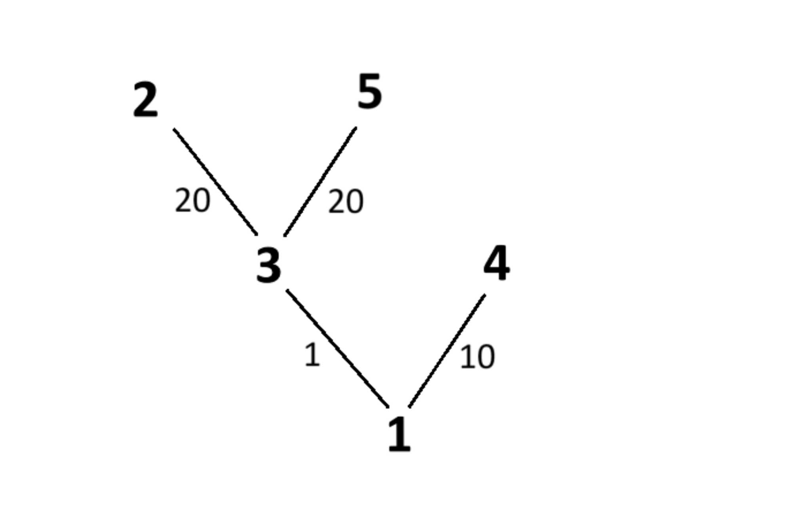

## A. Ромашки

- Лимит времени: **1000 мс**  
- Лимит памяти: **64 мб**

Маша и Даша собираются на день рождения Алёны. Ромашки — самые любимые цветы именинницы, поэтому в свой день рождения она решила устроить пикник посреди ромашкового поля. Своим подругам она отправила карту, на которой отметила координаты `q` вариантов места их встречи как `(xᵢ, yᵢ)` и попросила их выбрать лучшее место.

Маша и Даша решили посчитать, сколько ромашек они сумеют собрать в букет, пока будут добираться к каждому возможному месту встречи. Чтобы не заблудиться, подруги обусловились, что Маша начнёт свой путь из точки `(0, 0)` и будет идти только **вниз** и **направо**, а Даша — из точки `(n−1, m−1)`, где `n × m` — размеры поля, и идти лишь **вверх** и **влево**.

Им повезло, что на карте было также указано количество ромашек в каждой клетке поля. Считайте, что если девочка попадает в точку `(xᵢ, yᵢ)`, то она собирает все цветы с этого участка. Для каждого места встречи выведите максимальное количество цветов в собранном букете.

### Входные данные

- В первой строке заданы два числа: `n` и `m`, (`n * m ≤ 10⁵`).  


- Далее идут `n` строк, состоящие из `m` чисел, описывающих состояние поля.  


- Затем задаётся число `q` (`q ≤ 10⁶`) — количество возможных мест для пикника.  


- За ним следуют `q` строк, состоящие из пар чисел `xᵢ`,`yᵢ`, описывающих координаты мест встречи. Числа `xᵢ`,`yᵢ` меньше или равны по модулю `10⁹`.

### Выходные данные

Вывести в `q` строках максимальное количество цветов для каждого места встречи.

### Примеры

---

**STDIN**
```c++
3 3
1 1 1
1 2 1
1 1 1
3
1 0
2 1
0 2
```

**STDOUT**
```c++
6
6
5
```

---

**STDIN**
```c++
2 2
-1 -3
3 2
3
0 0
1 0
0 1
```

**STDOUT**
```c++
4
4
-2
```

---

## B. Горы Краснодарского края

- Лимит времени: **1000 мс**
- Лимит памяти: **128 мб**

После сильнейшего сдвига тектонических плит горы Краснодарского края стали еще выше и краше. Местные предприниматели решили создать крупнейший в мире горнолыжный курорт. Для того, чтобы привлечь внимание всех туристов, они решили сделать **самую длинную возрастающую по высоте канатную дорогу**.

Канатная дорога держится на сваях, но, к сожалению, мест для их установки оказалось не слишком много, поэтому организаторам необходимо выбрать необходимые места для реализации своей задумки.

### Входные данные

В первой строчке дано число `n` (`1 ≤ n ≤ 10⁶`) — количество доступных мест под сваи.

На второй строчке дана последовательность `a` длины `n`,  
`a₁, a₂, ..., aₙ` (`|aᵢ| ≤ 10⁹`) — высота `i`-ой сваи.

### Выходные данные

В первой строке выведите число `k` — длину канатной дороги.

Канатная дорога считается возрастающей по высоте, если  
`1 ≤ i₁ < i₂ < i₃ < ... < iₖ ≤ n`, где `a₁ < a₂ < a₃ < ... < aₖ`.

### Примеры

---

**STDIN**
```c++
5
1 3 5 5 2
```

**STDOUT**
```c++
3
```

---

**STDIN**
```c++
6 
1 2 5 3 4 1 
```

**STDOUT**
```c++
4
```

---

## C. Вот и поплавали!

- Лимит времени: **1000 мс**
- Лимит памяти: **128 мб**

В Киргизии в районе озера Иссык-Куль ходит местная маршрутка с крайне наглым водителем Анатолием. Развозя местных и туристов, водитель очень хочет как можно больше заработать и побыстрее попасть домой.

Остановившись возле очередного пляжа, Анатолий объявил, что из всех пассажиров он высадит ровно `m`, на остальных времени нет - ему нужно ехать дальше. Пассажиры были в шоке от такой наглости, но делать было нечего, и они начали предлагать водителю деньги, лишь бы он выпустил именно их на этой остановке.

Но вот незадача - места в маршрутке расположены рядами таким образом, что выйти из каждого ряда могут только крайние пассажиры (самый левый и самый правый). Прохода в центре маршрутки нет, поэтому выйти из центра ряда невозможно. Когда крайний человек из ряда выходит, доступ к выходу открывается следующему сидящему на этом краю данного ряда.

### Входные данные

- Первая строка - два числа, разделенных пробелом, — `n` (`1 ≤ n ≤100`) и `m` (`1 ≤ m ≤ 10⁴`) — количество рядов и количество людей, которые могут выйти на остановке.


- В следующих `n` строках описаны ряды в маршрутках: Первое число на `i`-й строке - количество людей, сидящих в этом ряду.


- Затем дано количество сомов (сом - местная валюта), которые предлагает человек Анатолию, чтобы он его выпустил на волю.

### Выходные данные

Найдите максимальную прибыль, которую получит Анатолий, выпустив `m` человек на остановке.

### Примеры

---

**STDIN**
```c++
2 3
3 3 7 2
3 4 1 5
```

**STDOUT**
```c++
15
```

---

**STDIN**
```c++
1 3
4 4 3 1 2
```

**STDOUT**
```c++
9
```

---

### Примечание

В первом примере люди сидят в двух рядах, по 3 человека в каждом. Чтобы получить максимальную прибыль, нужно выпустить двух людей с левого края первого ряда и одного с правого края второго ряда.

Во втором примере ряд всего один. Выпустим двух людей с левого края и одного с правого.

---

## D. Праздник к нам приходит [доп. балл]

- Лимит времени: **1000 мс**
- Лимит памяти: **128 мб**

В новогоднюю ночь Санта-Клаус по привычке облетал дома и дарил всем долгожданные подарки. Когда он подлетел к началу очередной улицы, его эльфы шепнули ему на ухо: “Это же Софийская улица - самая длинная в Санкт-Петербурге!”. Санта почесал седую бороду, задумавшись о том, как бы быстрее раздать все подарки, и обратился к самому умному из своих эльфов: “Как же нам облететь дома, да только так, чтоб сначала тем, кто помладше, подарки подарить, а потом кому постарше - ведь малыши раньше спать ложатся, нужно обязательно успеть, пока они не уснули!”. Перед тем, как начать облетать дома, Санта находится в начале улицы (**у дома с номером 1**). Считая, что *перелет* между двумя соседними домами занимает **одну минуту**, и *остановка*, чтобы отдать подарок, тоже занимает **одну минуту**, посчитайте минимальное время, за которое Санта раздаст все подарки, передвигаясь в порядке неубывания возраста получателей.

### Входные данные

В единственной строке записано...  

- Первая строка - число `n` (`1 ≤ n ≤ 10⁵`) - количество домов на Софийской улице  


- Вторая строка - `n` чисел `aᵢ` (`1 ≤ aᵢ ≤ 10⁹`) - возраст человека, живущего в `i`-м доме

### Выходные данные

Одно число - минимальное время в минутах.

### Примеры

---

**STDIN**
```c++
6 
3 2 5 6 2 5 
```

**STDOUT**
```c++
21
```

---

### Примечание

Пояснения к примеру:

1. Санта летит от 1 дома к 5 (4 минуты)  
2. Санта отдает подарок жителю 5 дома (1 минута)  
3. Санта летит от 5 дома ко 2 (3 минуты)  
4. Санта отдает подарок жителю 2 дома (1 минута)  
5. Санта летит от 2 дома к 1 (1 минута)  
6. Санта отдает подарок жителю 1 дома (1 минута)  
7. Санта летит от 1 дома к 3 (2 минуты)  
8. Санта отдает подарок жителю 3 дома (1 минута)  
9. Санта летит от 3 дома к 6 (3 минуты)  
10. Санта отдает подарок жителю 6 дома (1 минута)  
11. Санта летит от 6 дома к 4 (2 минуты)  
12. Санта отдает подарок жителю 4 дома (1 минута)

---

## E. Картонная избушка

- Лимит времени: **2000 мс**
- Лимит памяти: **256 мб**

Криминальный гений, которого все знают как Учёного, решил, что ему удастся обойти систему безопасности Нефтекамского городского банка. Для этого он собрал команду авантюристов со всей страны. Чтобы оставаться анонимными, даже между собой они общались без имён — использовали названия городов. Самый ловкий шпион, известный как Ростов, сумел выяснить, что у Николая Николаевича, директора банка, есть любимое число — `k`, и все пароли он подбирает таким образом, чтобы они на него делились без остатка. Также во всех его паролях чётность соседних цифр чередуется. Профессиональный взломщик Иркутск и его напарница Якутск — ответственные за самую важную часть ограбления: взлом сейфа. Они как никто другой знают, что чтобы план точно удался, необходимо с точностью до секунды просчитать все свои действия, поэтому обратились к Вам за помощью, чтобы узнать, какое время необходимо заложить на этот этап. Авантюристы уверены, что пароль состоит из `n` символов, а на перебор одного варианта тратится ровно одна секунда. Посчитайте, сколько секунд потребуется грабителям, чтобы перебрать все возможные варианты пароля.

### Входные данные

В первой строке через пробел задаются два натуральных числа: `n` (`n ≤ 10⁴`) — длина пароля и `k` (`k ≤ 10³`) — любимое число Николая Николаевича.

### Выходные данные

Вывести сколько секунд следует заложить грабителям на перебор всех варантов пароля. Ответ считайте по модулю `10⁹ + 7`.

### Примеры

---

**STDIN**
```c++
2 2
```

**STDOUT**
```c++
25
```

---

**STDIN**
```c++
4 156
```

**STDOUT**
```c++
6
```

---

## F. Петя делает скриншот

- Лимит времени: **1000 мс**
- Лимит памяти: **128 мб**

Петя в течение семестра получал различные баллы. Для простоты будем считать, что **существуют только отметки** *«1»* и *«5»*. В конце семестра, чтобы получить подарок на Новый год, он решил похвастаться своей успеваемостью перед родителями.

Петя собирается сделать «скрин» журнала, который представляет собой квадрат со стороной `X`. Петя не хочет, что бы родители видели, что он получал плохие отметки, поэтому ему необходимо сделать *скрин*, на котором **содержатся исключительно «5»**. Помогите Пете сделать максимально красивый скриншот. Красота скриншота напрямую зависит от его размеров, чем больше его площадь — тем он красивее. Журнал представляет из себя матрицу с размерами `N` на `M`.

Гарантируется, *что Петя получил хотя бы одну «5»*.

### Входные данные

- В первой строке входных данных задается два числа через пробел `1 ≤ N, M ≤ 3000`.


- В следующих `N` строчках содержится по `M` цифр `1` и `5` — баллы Пети. Следует обратить внимание, что *цифры в строке не разделены пробелами*.

### Выходные данные

Необходимо вывести **3 числа**, разделенные пробелами — длину стороны скриншота и координаты его левого верхнего угла. Если возможных ответов несколько, выведите координаты левого верхнего угла самого нижнего правого квадрата (самый правый среди самых низких квадрат).

### Примеры

---

**STDIN**
```c++
5 5 
55511
55555
55555
55555
11111
```

**STDOUT**
```c++
3 2 3
```

---

## G. Всё или ничего

- Лимит времени: **1000 мс**
- Лимит памяти: **128 мб**

Нерадивый первокурсник по имени Миша попал на комиссию по отчислению из-за незакрытых дисциплин АиСД и ИСРПО. Благо, студенту попались понимающие преподаватели, которые предложили ему решить всего одну задачу, которая спасет его от отчисления.

Пусть дано бинарное дерево коммитов. Вершины этого дерева — названия (номера) коммитов, а вес ребра, которым данный коммит присоединяется к родительскому, — количество добавленных строчек кода.

Необходимо оставить `m` веток таким образом, чтобы сохранилось как можно больше написанного кода.

Примечание: ***Очевидно, при удалении ребра удаляется также всё его поддерево, ведь иначе задача была бы совсем очевидной :)***



### Входные данные

Первая строка содержит два числа — `n` (`2 ≤ n ≤ 1000`) и `m` (`1 ≤ m ≤ n − 1`) — количество коммитов и количество веток, которые нужно сохранить.  

Следующие `n−1` строк описывают ребра дерева: каждая строка состоит из трёх чисел — `start`, `end`, `lines` — название “родительского” коммита, “дочернего” и количество строк, добавленных дочерним коммитом.

### Выходные данные

Одно число — максимальное количество строк кода, которое можно сохранить. Не забудьте сохранить корень.

### Примеры

---

**STDIN**
```c++
5 2
1 3 1
1 4 10
3 2 20
3 5 20
```

**STDOUT**
```c++
21
```

---

**STDIN**
```c++
3 2
1 2 2
1 3 1
```

**STDOUT**
```c++
3
```

---

### Примечание

Пояснения к примеру:  
Удалив ветки между коммитами {1, 4} и {3, 2}, получим оставшиеся ветки {1, 3} и {3, 5}, сохранив таким образом 21 строчку кода.  
(Аналогичный результат можно получить, удалив {1, 4} и {3, 5}).

---

## H. Петя делает скриншот, но есть нюанс

- Лимит времени: **1000 мс**
- Лимит памяти: **2 мб** ⟵

Петя в течение семестра получал различные баллы. Для простоты будем считать, что **существуют только отметки** *«1»* и *«5»*. В конце семестра, чтобы получить подарок на Новый год, он решил похвастаться своей успеваемостью перед родителями.

Петя собирается сделать «скрин» журнала, который представляет собой квадрат со стороной `X`. Петя не хочет, что бы родители видели, что он получал плохие отметки, поэтому ему необходимо сделать *скрин*, на котором **содержатся исключительно «5»**. Помогите Пете сделать максимально красивый скриншот. Красота скриншота напрямую зависит от его размеров, чем больше его площадь — тем он красивее. Журнал представляет из себя матрицу с размерами `N` на `M`.

Гарантируется, *что Петя получил хотя бы одну «5»*.

### Входные данные

- В первой строке входных данных задается два числа через пробел `1 ≤ N, M ≤ 3000`.


- В следующих `N` строчках содержится по `M` цифр `1` и `5` — баллы Пети. Следует обратить внимание, что *цифры в строке не разделены пробелами*.

### Выходные данные

Необходимо вывести **3 числа**, разделенные пробелами — длину стороны скриншота и координаты его левого верхнего угла. Если возможных ответов несколько, выведите координаты левого верхнего угла самого нижнего правого квадрата (самый правый среди самых низких квадрат).

### Примеры

---

**STDIN**
```c++
5 5 
55511
55555
55555
55555
11111
```

**STDOUT**
```c++
3 2 3
```

---