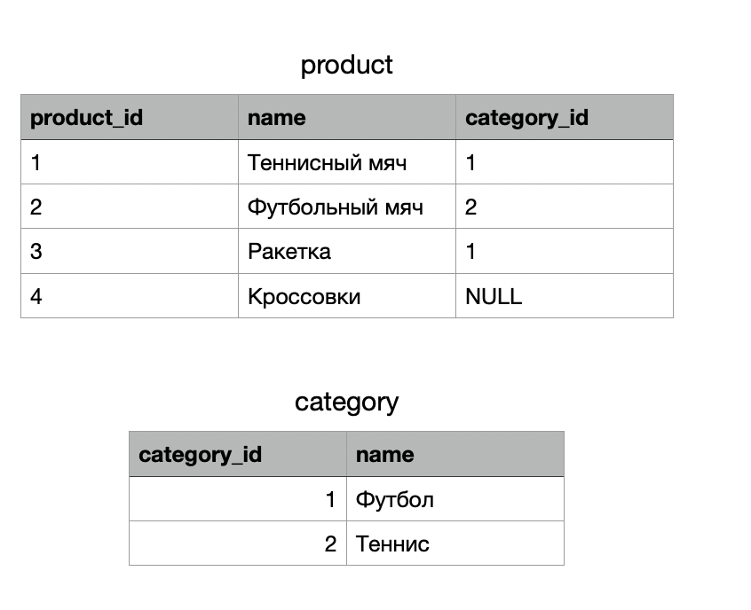
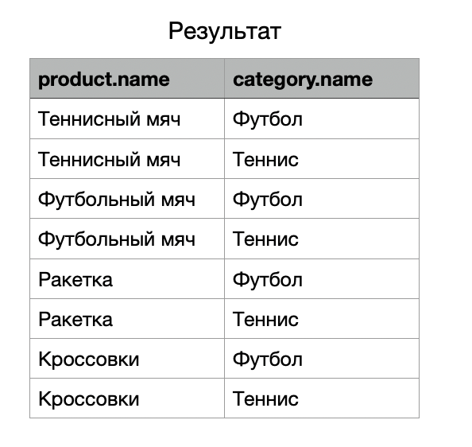
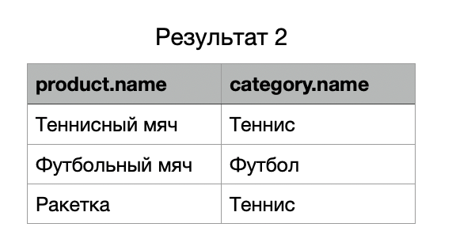
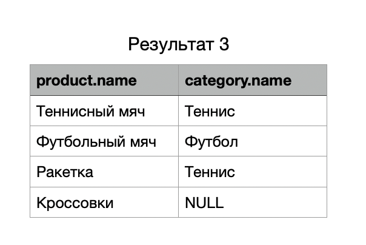
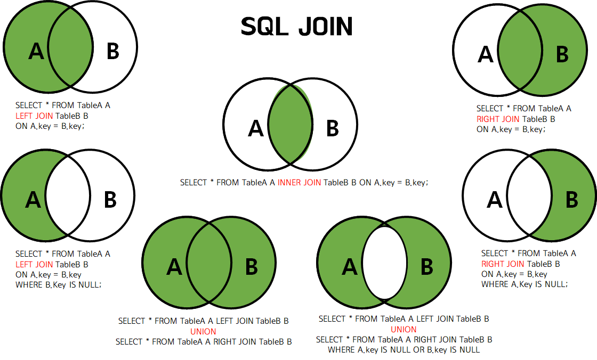

# *Лабораторная работа №3*

> `JOIN`

До этого все наши запросы обращались только к одной таблице. Однако
запросы могут также обращаться сразу к нескольким таблицам или
обращаться к той же таблице так, что одновременно будут обрабатываться
разные наборы её строк. Запросы, обращающиеся к разным таблицам (или
нескольким экземплярам одной таблицы), называются *соединениями* (JOIN).
Такие запросы содержат выражение, указывающее, какие строки одной
таблицы нужно объединить со строками другой таблицы.

Для того чтобы сопоставить данные одной таблицы с другой используют
foreign key(FK, внешний ключ), который ссылается на primary key(PK,
первичный ключ) другой таблицы.



В данном случае мы видим, что таблица product имеет атрибут category_id
который ссылается на PK таблицы category.

Вполне допустим следующий запрос:

```SQL
SELECT product.name, category.name FROM product, category
```

В результате мы получим декартово произведение двух таблиц (**CROSS
JOIN**).



Но результат нас вряд ли устроит.

Тогда давайте явно укажем правило, по которому стоит сопоставлять
таблицы:

```SQL
SELECT * FROM product JOIN category ON product.category_id = category.category_id
```



Уже лучше, но в таком запросе мы получили не все товары, а только те,
которые имеют категорию. Данный тип связи называется **INNER JOIN**.

Чтобы вывести все товары, вне зависимости от наличия категории, нам
нужно воспользоваться LEFT JOIN:

```SQL
SELECT * FROM product LEFT JOIN category ON product.category_id = category.category_id
```



Все виды джоинов и их синтаксис более наглядно:



На практике чаще всего применяется INNER И LEFT.

Попробуем сделать тоже самое на учебной базе данных.

```SQL
SELECT p.name, s.name
FROM production.product AS p INNER JOIN
production.product_subcategory AS s
ON p.product_subcategory_id = s.product_subcategory_id
```

(Кстати для сокращения записи можно пользоваться алиасами AS.)

Пользователь получит список названий товаров и названий категорий, к
которым относится товар, при этом не будут рассмотрены товары, для
которых подкатегория не определена. INNER JOIN не учитывает NULL
значения как в левой, так и в правой таблице при объединении.
Синтаксически допустимо и традиционно используется сокращение названия
соединения INNER JOIN до просто JOIN. В рассмотренном выше запросе
объединяются таблицы Product и

ProductSubcategory, каждая из которых имеет столбец с именем Name. Чтобы
различать эти столбцы при объединении, были введены псевдонимы таблиц, и
к столбцу Name обращение идет через оператор доступ -- точка.

```SQL
SELECT p.Name, s.Name
FROM production.product AS p LEFT JOIN
production.product_subcategory AS s
ON p.product_subcategory_id = s.product_subcategory_id
```

LEFT JOIN учитывает значения NULL из левой таблицы. Таким образом
нижеприведенный запрос вернет названия продуктов и название
подкатегорий, в том числе и те случаи, когда у продукта не определена
подкатегория. Если подкатегория продукта не определена, то ее название
будет NULL.
