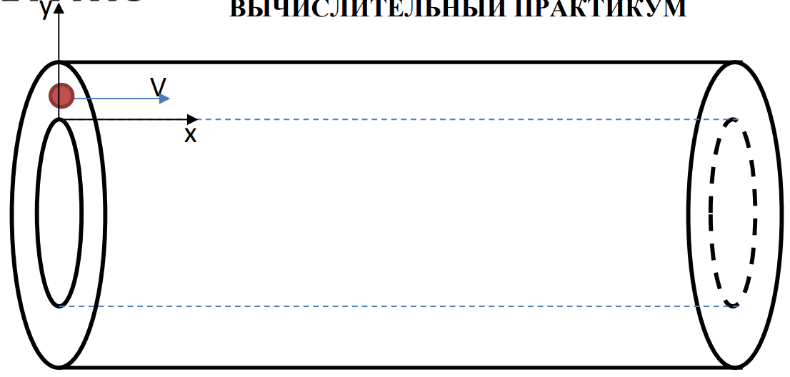

## *Частица в конденсаторе*

Электрон влетает в цилиндрический конденсатор с начальной скоростью **V**, посередине между обкладками, параллельно образующим цилиндра. При какой **минимальной разности потенциалов**, приложенной к обкладкам, электрон не успеет вылететь из конденсатора. Краевыми эффектами пренебречь.

Построить графики зависимости **y(x)**, **Vy(t)**, **ay(t)**, **y(t)**. Координатные оси направлены как показано на рисунке.

Рассчитать время полета **t** и конечную скорость электрона **Vₖₒₙ**.

Данные по размерам конденсатора и скорости электрона взять из таблицы. Номер варианта соответствует номеру по списку группы.

---

