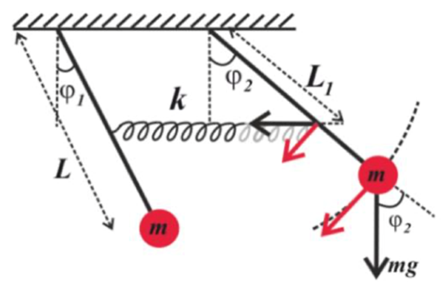

## *Связанные математические маятники*

Два одинаковых математических маятника, связанных пружиной с коэффициентом жёсткости **k** на расстоянии **L₁** от точки крепления маятников. Точки крепления обоих связанных маятников находятся на одном уровне.

Оба математических маятника имеют динаковые длины подвеса **L** и массы **m** (см. Схему).

Сила сопротивления для каждого маятника прямо пропорциональна скорости. Коэффициент затухания каждого маятника равен **β**.

Для заданных начальных отклонений построить графики зависимостей углов и скоростей от времени для каждого маятника. Найти нормальные частоты.

Параметры должны задаваться.

---

