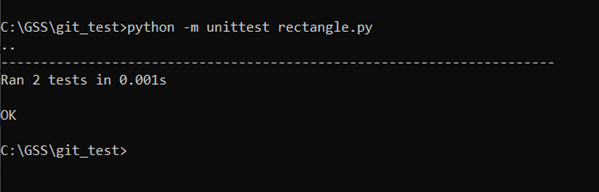
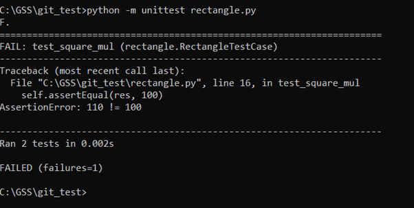

# *Unit-тестирование*

Среди всех тестов львиную долю занимают именно unit-тесты. В классическом понимании unit-тесты позволяют быстро и автоматически протестировать отдельные части ПО независимо от остальных.  
Рассмотрим простой пример создания unit-тестов

### Задача

Изучить процесс создания **unit-тестов**.
Реализовать тесты для функций проекта и подготовить план тестирования

### Порядок выполнения

#### 1. Ручное тестирование (простой вариант, подготовительный этап):

- Зная алгоритм нахождения периметра и площади фигуры, определить наборы входных данных для тестируемых функций
- Зная входные данные, рассчитать ожидаемые результаты вручную
- Запустить программу с подготовленными входными данными
- Сравнить полученный результат работы программы с ожидаемым.  
Если совпали — идем дальше, если нет — сообщаем об ошибке, фиксируем в протоколе тестирования

#### 2. Автоматическое тестирование с использованием `unittest`:

- Убедиться, что модуль `unittest` установлен (в Python входит по умолчанию, при необходимости установить с помощью `pip`)
- Написать тесты в отдельном классе
- Требования к тестам:
    - класс должен наследоваться от `unittest.TestCase`
    - имена всех тестовых функций должны начинаться с `test`
    - в тестах использовать операторы сравнения (`assertX`) — именно они будут проверять соответствие фактических результатов и ожидаемых
- **Пример теста** (для файла `rectangle.py`):
   ```python
   import unittest
   ...

   class RectangleTestCase(unittest.TestCase):
       def test_zero_mul(self):
           res = area(10, 0)
           self.assertEqual(res, 0)

       def test_square_mul(self):
           res = area(10, 10)
           self.assertEqual(res, 100)
   ```
- Запуск тестов:
   ```
   python -m unittest rectangle.py
   ```
    - Если тесты проходят успешно — все проверки будут отмечены как пройденные:
      
    - Если тест не пройден — будет выведено сообщение об ошибке:
      

### Подготовка отчёта

Написать **план тестирования**, который минимально должен содержать:
1. **Цели и задачи тестирования** — определение основных целей тестирования из задач, которые необходимо достичь в процессе тестирования
2. **Описание тестируемого продукта** — описание функциональности, особенностей и требований к продукту, которые должны быть протестированы
3. **Область тестирования** — какие именно функции/модули или компоненты продукты тестируются
4. **Стратегия тестирования** — описание общего подхода, методов, техник и типов тестирования  
*Например: функциональное тестирование, тестирование производительности, тестирование безопасности и т.д.*
5. **Критерии приёмки** — условия и критерии, которые должны быть выполнены для успешного завершения тестирования и приемки продукта
6. **Ожидаемые результаты** — отчёты о дефектах, статусы тестирования, метрики качества и др. соответствующие данные

---

### Примечание

- Исходный код тестов должен быть размещён на **GitHub** (или другом общедоступном репозитории)
- В истории проекта зафиксирован факт добавления тестов
- При форматировании документа опираемся на опыт, полученный в ходе выполнения [2 лабораторной работы](../Lab-2/README.md)